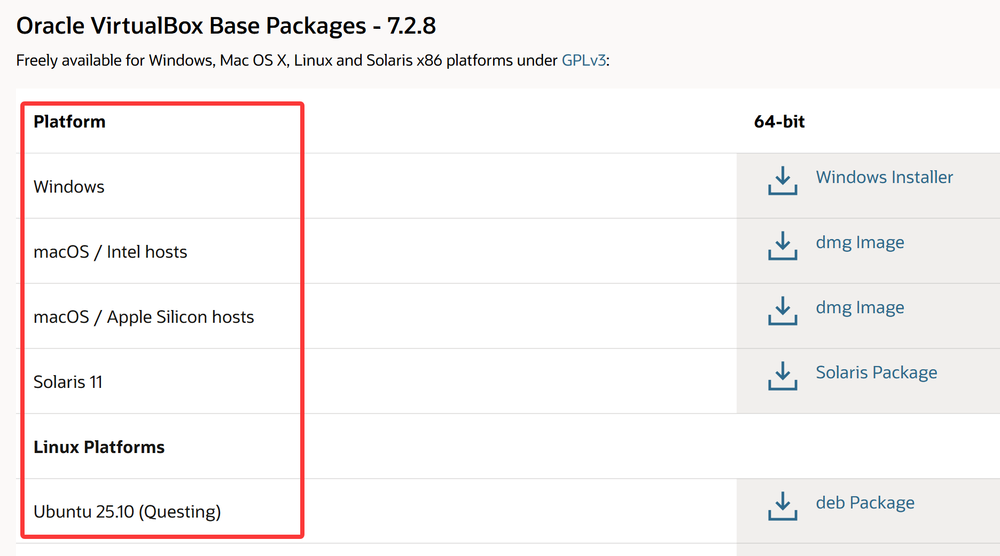
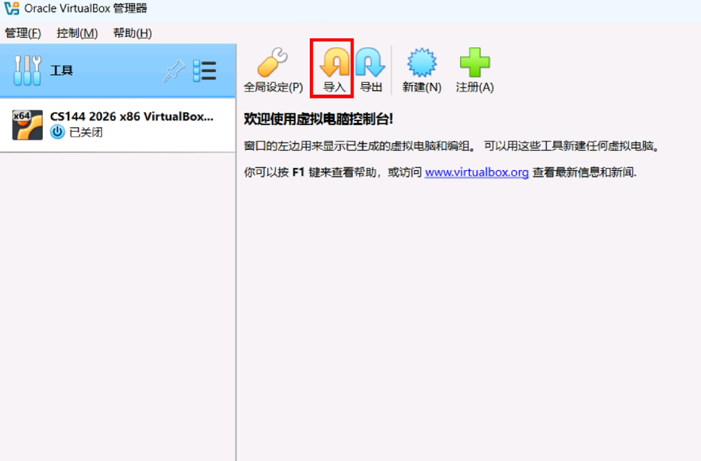
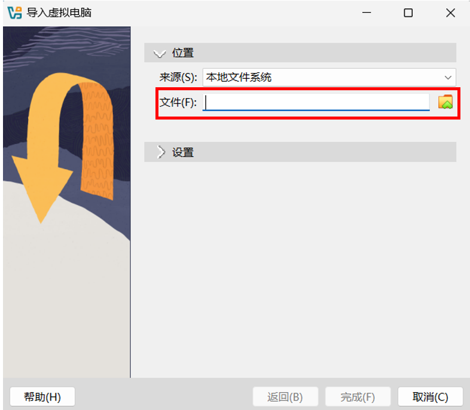
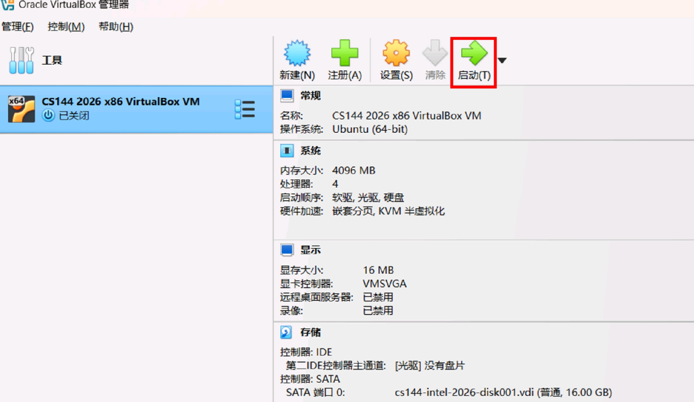
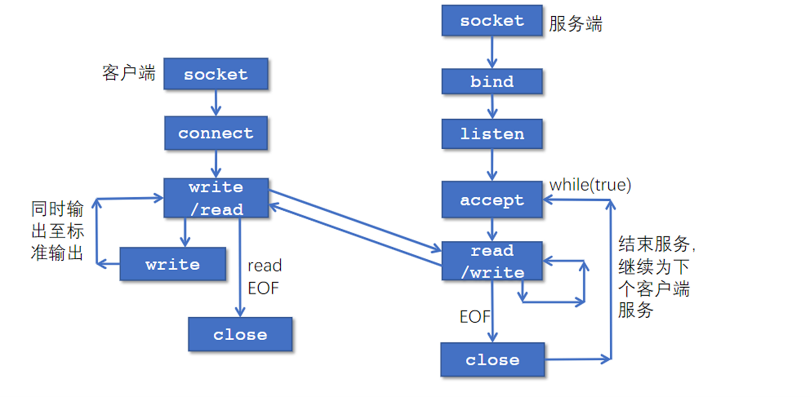
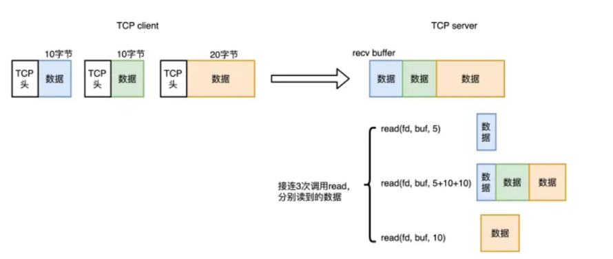
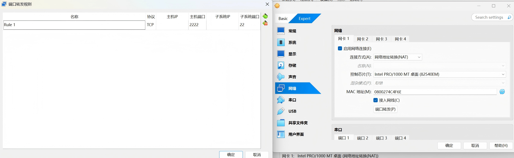

# Lab 2 Webget 与字节流（ByteStream）

!!! warning "注意"
    实验报告提交 DDL 为 2026 年 10 月 11 日 23:59，请同学们留意。

    提交作业时请同时提交实验报告和源代码。

!!! note "说明"
    Lab 2–5 的实验内容与 CS144 对齐，我们将在这些实验中实现一个完整的 TCP/IP 协议栈。

## 1 环境配置

为避免不必要的环境问题，建议使用虚拟机，并基于 CS144 官方提供的镜像完成实验。

### 1.1 安装 VirtualBox 并下载虚拟机镜像

VirtualBox：<https://www.oracle.com/cn/virtualization/virtualbox/>

虚拟机镜像：<https://stanford.edu/class/cs144/vm_files/cs144-fall-2026-x86.ova>（文件较大，建议预留 1～2 小时下载）



!!! warning "注意"
    如果你使用配备 Apple Silicon（M 系列芯片）的 MacBook，VirtualBox 可能无法正常运行。请按照课程官方建议，使用 UTM 和 ARM64 虚拟机镜像。

    UTM：<https://mac.getutm.app/>

    ARM64 虚拟机镜像：<https://web.stanford.edu/class/cs144/vm_files/cs144-2026-arm.utm.tar.gz>

### 1.2 导入 CS144 镜像

启动 **VirtualBox**，你会看到如下界面：



单击“导入”，打开如下窗口。选择已经下载的 **cs144_vm.ova** 镜像文件。无需修改默认设置，单击“完成”导入镜像。



在左侧选择刚刚导入的虚拟机，然后单击“启动”。



虚拟机会启动至文本界面，用户名和默认密码均为 `cs144`。

### 1.3 连接虚拟机

建议通过 **SSH** 连接虚拟机，并使用 VS Code 进行远程编辑。CS144 镜像已经配置端口转发：主机的 `localhost:2222` 会被转发到虚拟机的 22 号端口（SSH）。虚拟机启动后，可运行以下命令连接。若连接失败，请参考文末的注意事项。

```bash
ssh -p 2222 cs144@localhost
```

### 1.4 安装所需软件包

以下命令将安装实验所需的软件包：

```bash
sudo apt update && sudo apt install git cmake gdb build-essential clang \
clang-tidy clang-format gcc-doc pkg-config glibc-doc tcpdump tshark libpcap-dev
```

## 2 使用网络

在开始编码之前，我们先使用应用层程序访问一个网页。

### 2.1 使用浏览器访问网页

使用浏览器访问 <http://cs144.keithw.org/hello>，你将看到如下结果。浏览器是典型的应用层程序，它会构造符合 **HTTP** 协议的请求并发送给服务器，再解析并呈现服务器返回的响应。


### 2.2 使用 Telnet 获取网页

**Telnet** 也是一种应用层程序。与浏览器不同，使用 Telnet 连接服务器时，需要手动输入 HTTP 请求报文。

1. 在虚拟机中运行 `telnet cs144.keithw.org http [Enter]`。该命令会通过 HTTP 服务端口与 `cs144.keithw.org` 建立可靠的字节流连接。如果虚拟机配置正确且网络连接正常，你将看到以下输出：
```
$ telnet cs144.keithw.org http
Trying 104.196.238.229...
Connected to cs144.keithw.org.
Escape character is '^]'.
```
按住 `Ctrl` 并按下 `]`，然后输入 `close` 退出连接。

2. 输入 `GET /hello HTTP/1.1 [Enter]`，指定请求的 URL 路径。
3. 输入 `Host: cs144.keithw.org [Enter]`，指定请求的主机。
4. 输入 `Connection: close [Enter]`，告知服务器在响应后关闭连接。
5. 再按一次 `[Enter]`，发送一个空行以结束请求头。

!!! warning "注意"
    输入上述内容时请尽量迅速，否则连接可能因超时而断开。

操作成功后，你将看到与浏览器所显示内容相同的响应。

```
GET /hello HTTP/1.1
Host: cs144.keithw.org
Connection: close

HTTP/1.1 200 OK
Date: Thu, ...
Server: Apache
Last-Modified: Thu, 13 Dec 2018 15:45:29 GMT
ETag: "e-57ce93446cb64"
Accept-Ranges: bytes
Content-Length: 14
Connection: close
Content-Type: text/plain

Hello, CS144!
Connection closed by foreign host.
```

## 3 Webget

对比上述两个应用层程序可以发现，它们都建立在 **socket** 之上。Socket（套接字）是操作系统向应用程序提供的网络通信接口，它对 TCP、UDP 等传输层协议进行了抽象封装。应用程序通过 socket 建立连接并收发数据。本节将编写一个简短的应用层程序 **webget**，通过 Linux 内核提供的 **stream socket** 接口获取网页内容。

### 3.1 建立仓库

1. 在虚拟机中输入 `git clone https://github.com/ZJU-Zhiyi/zju-comnet-labs-2026.git [Enter]`，克隆实验初始代码。
2. 输入 `cd zju-comnet-labs-2026 [Enter]` 进入项目目录。
3. 输入 `mkdir build [Enter]` 创建 `build` 目录。
4. 输入 `cd build [Enter]` 进入 `build` 目录。
5. 输入 `cmake .. [Enter]` 配置项目。
6. 输入 `make [Enter]` 编译项目。每次修改代码后，都需要重新运行 `make`。

!!! note "提示"
    由于通过 HTTPS 访问 GitHub 时可能不稳定，建议使用 SSH 管理 Git 仓库。配置方法可参考 <https://zhuanlan.zhihu.com/p/628727065>。

### 3.2 OS Stream Socket

在 Linux 中，**stream socket** 以文件描述符的形式供程序使用。两个 stream socket 建立连接后，写入一端的字节最终会按相同顺序从另一端读出。下图展示了基于 TCP/IP 协议的客户端—服务器通信流程。



- 服务器端负责等待连接并提供服务：

    - `socket`：创建套接字，即网络通信的端点。
    - `bind`：将套接字绑定到本地地址（IP 地址和端口号）。
    - `listen`：使套接字进入监听状态，等待客户端的连接请求。
    - `accept`：阻塞并等待客户端连接。收到连接请求后，创建一个新的套接字与该客户端通信。
    - `while (true)`：服务器通常会循环调用 `accept`，持续等待并处理新的客户端连接。
    - `read`/`write`：通过已经连接的套接字收发数据。
    - `close`：关闭与当前客户端通信的套接字。

- 客户端负责发起连接并请求服务：

    - `socket`：创建套接字。
    - `connect`：向服务器的指定地址和端口发起连接。连接成功后，即可开始传输数据。
    - `write`/`read`：通过已经建立的连接向服务器发送数据，或读取服务器返回的数据。
    - `read EOF`：客户端读取到文件结束标志，表示服务器已经关闭连接或关闭写入方向。
    - `close`：关闭套接字，终止与服务器的连接。

### 3.3 实现 webget

请阅读 `libsponge/util/socket.hh` 和 `libsponge/util/file_descriptor.hh` 中的公开接口。注意，`Socket` 继承自 `FileDescriptor`，`TCPSocket` 继承自 `Socket`。请熟悉这些接口的定义和调用方法。

接下来，你将调用 `TCPSocket` 的接口实现应用层程序 `webget`。其功能与前面的 Telnet 类似，用于获取网页内容。

1. 在编辑器中打开 `/path/to/zju-comnet-labs-2026/apps/webget.cc`。

2. 使用 `TCPSocket` 和 `Address` 类完成 `get_URL` 函数。你需要通过 socket 建立连接，按照 HTTP 格式发送请求，并读取服务器返回的全部数据。

    !!! warning "注意"
        - 在 HTTP 中，每行必须以 `\r\n` 结尾。

        - 客户端请求中必须包含 `Connection: close` 请求头。

        - 持续读取并输出服务器响应，直到套接字到达 EOF。

3. 重新运行 `make` 编译项目。

4. 运行 `/path/to/zju-comnet-labs-2026/build/apps/webget cs144.keithw.org /hello [Enter]` 测试程序。

5. 如果输出符合预期，可运行 `make check_webget [Enter]` 进行自动测试。测试脚本位于 `/path/to/zju-comnet-labs-2026/tests/webget_t.sh`。

    !!! warning "注意"
        如果测试超时，请检查网络、DNS、代理或 VPN 设置。

完成 **get_URL** 函数后，运行测试将看到类似以下结果：

```
$ make check_webget
[100%] Testing webget...
Test project /path/to/zju-comnet-labs-2026/build
    Start 31: t_webget
1/1 Test #31: t_webget .........................   Passed    1.19 sec

100% tests passed, 0 tests failed out of 1

Total Test time (real) =   1.19 sec
[100%] Built target check_webget
```

## 4 可靠的字节流

在上一节中，我们调用 socket 接口完成了简易的 webget 应用程序。本节将实现一个简化的 socket 读写缓冲区（ByteStream）。如下图所示，建立连接后，TCP 会维护发送（send）和接收（recv）两个缓冲区。以接收缓冲区为例，客户端发送的数据会依次写入缓冲区，服务器则可以按需读取。



你将自己实现一个字节流。字节从“输入”端写入，并按照相同顺序从“输出”端读出。**writer** 可以结束输入，此后不得再写入任何字节；**reader** 读到流末尾时会遇到 **EOF**（end of file），此后不会再读到任何字节。

字节流还需要进行容量控制。构造字节流时会指定容量（capacity），即缓冲区最多能够保存的字节数。缓冲区写满后，**writer** 必须停止写入；当 **reader** 读出字节并释放空间后，**writer** 才能继续写入。

打开 `libsponge/byte_stream.hh` 和 `libsponge/byte_stream.cc`，设计所需的私有成员并完成接口实现。接口可以分为以下四类：

1. 构造函数
```c++
ByteStream(const size_t capacity); // 初始化自行设计的私有成员
```
2. Writer
```c++
size_t write(const std::string &data); // 将 data 中尽可能多的字节写入 stream，返回实际写入的字节数
size_t remaining_capacity() const; // 返回 stream 的剩余容量
void end_input(); // 标记输入结束，此后不再接受新的写入
void set_error() { _error = true; } // 将错误标志 _error 设为 true
```
3. Reader
```c++
std::string peek_output(const size_t len) const; // 返回接下来至多 len 个字节，但不移除它们
void pop_output(const size_t len); // 从 stream 中移除至多 len 个字节
std::string read(const size_t len); // 读取至多 len 个字节，即先 peek 再 pop
bool input_ended() const; // 输入结束时返回 true
bool error() const { return _error; } // stream 发生错误时返回 true
size_t buffer_size() const; // 返回当前可读取的字节数
bool buffer_empty() const; // 缓冲区为空时返回 true
bool eof() const; // 输入结束且缓冲区为空时返回 true
```
4. General Accounting
```c++
size_t bytes_written() const; // 返回累计成功写入的字节数
size_t bytes_read() const; // 返回累计从 stream 中移除的字节数
```

完成实现并重新编译项目后，可运行 `make check_lab0 [Enter]` 进行自动测试。若实现正确，你将看到类似以下结果：

```
$ make check_lab0
[100%] Testing Lab 0...
Test project /path/to/zju-comnet-labs-2026/build
    Start 26: t_byte_stream_construction
1/9 Test #26: t_byte_stream_construction .......   Passed    0.00 sec
    Start 27: t_byte_stream_one_write
2/9 Test #27: t_byte_stream_one_write ..........   Passed    0.00 sec
    Start 28: t_byte_stream_two_writes
3/9 Test #28: t_byte_stream_two_writes .........   Passed    0.00 sec
    Start 29: t_byte_stream_capacity
4/9 Test #29: t_byte_stream_capacity ...........   Passed    0.25 sec
    Start 30: t_byte_stream_many_writes
5/9 Test #30: t_byte_stream_many_writes ........   Passed    0.00 sec
    Start 31: t_webget
6/9 Test #31: t_webget .........................   Passed    1.09 sec
    Start 53: t_address_dt
7/9 Test #53: t_address_dt .....................   Passed    0.01 sec
    Start 54: t_parser_dt
8/9 Test #54: t_parser_dt ......................   Passed    0.00 sec
    Start 55: t_socket_dt
9/9 Test #55: t_socket_dt ......................   Passed    0.00 sec

100% tests passed, 0 tests failed out of 9

Total Test time (real) =   1.38 sec
[100%] Built target check_lab0
```

!!! note "提示"
    如果仍不清楚接口的实现逻辑，可以阅读测试用例以加深理解：

    - `/path/to/zju-comnet-labs-2026/tests/` 下的 `byte_stream_test_harness.hh` 和 `byte_stream_test_harness.cc` 包含测试辅助类的声明与实现。
    - `/path/to/zju-comnet-labs-2026/tests/byte_stream_*.cc` 是具体测试用例。

!!! warning "注意"
    - 如果无法通过 SSH 连接虚拟机，并出现 `Connection Refused` 提示，可以在 VirtualBox 的虚拟机设置中手动添加端口转发规则，如下图所示。
    
    - 如果你使用的是 MacBook，并且在 UTM 中找不到端口转发选项，可以在设置中将网络模式调整为“模拟 VLAN”。
